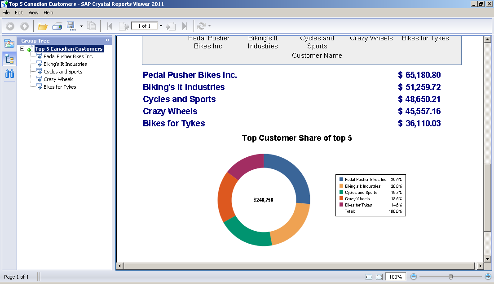

# Crystal-Reports
 This was a course on SAP's [ Crystal Reports ](http://www.crystalreports.com/). The class was offered by the online [Ed2Go ](http://www.ed2go.com/) system for online courses. I got a good amount out of it. The courses are really quite thorough and written well. 

 It touches a bunch of Crystal Reports report types and topics, and, from that, I was able to make reports that showed off each of the features of crystal reports that I generated. 

 These include things such as crosstabs, custom functions, filters, grouping, charts, subreports and maps. 

 An examples of a report I generated can be seen linked below. You can view these using SAP's free [ Crystal Reports Viewer ](http://www.sap.com/solutions/sme/business-intelligence-crystal-solutions/sap-crystal-reports-viewer/index.epx) software. 

[ Sample Report ](Top 5 Canadian Customers.rpt)

This is a chart and bar graph report of the top 5 Canadian customers for Xtreme Cycles. The data used is from the sample [Xtreme.mdb ](https://smpdl.sap-ag.de/~sapidp/012002523100005852352008E/cr_xi_xtreme_rep_smpl_en.zip) MS Access database that you can download from SAP's website. 
